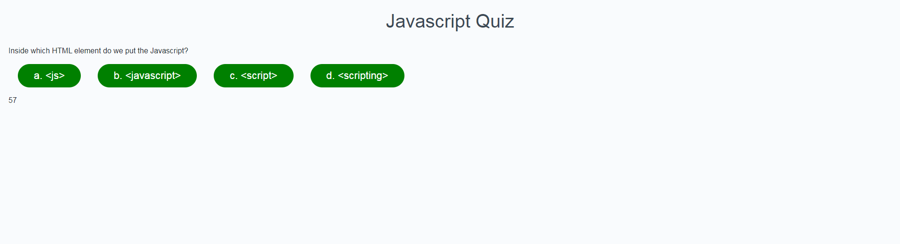

# Javascript-Quiz

1. Made an index.html file that reflects everything the pages will need.
2. Modified an existing CSS file to be used here.
3. In JS file think of all functions that could be needed.
4. define the variables you will need in JS file.
5. Make start button disappear and questions appear after start
    is clicked.
6. Display the question.
7. Display the answers to that question.
8. Move to next question when answer is clicked.
9. If answer is wrong, subtract time from the timer.
10. If answer is correct, add 10 to the score.
11. When all questions are done, add remaining time to the score
    to get the totalScore.
12. If time runs out before questions are done, got to results
    page.
13. Results page should display the score, a textbox to put initials in
    and a submit button.
14. When results page displays- questions, answers, and timer should
    be hidden.
15. When the submit button is clicked, the high score should be save in 
    local storage and user should be shown a list of their high scores.
16. The high scores should be shown from Highest to lowest.
17. Just discovered that results page does not automatically come up if 
    time hits 0. I can't figure out why. --Fixed 10/1/2020
18. Score now shows a score of 0 instead of undefined if all answers are wrong.

Link to deployed app: https://kas1330.github.io/Javascript-Quiz/

